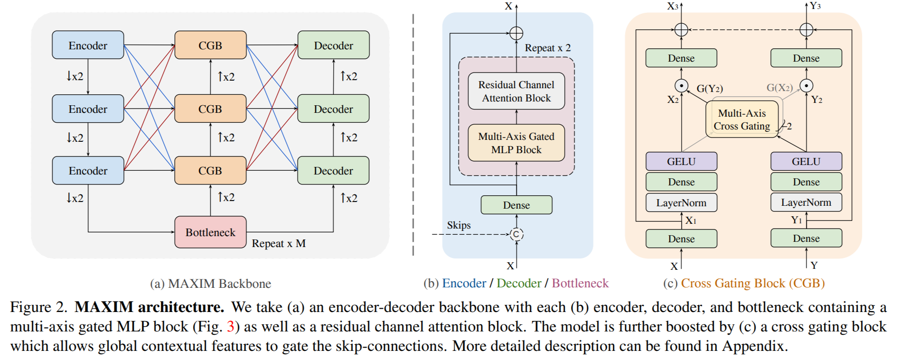
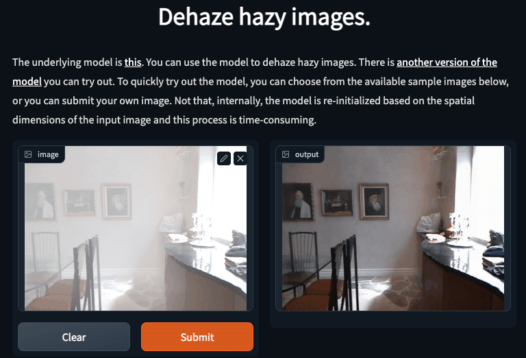

# MAXIM in TensorFlow

[](https://huggingface.co/spaces/sayakpaul/maxim-spaces)
[](https://colab.research.google.com/github/sayakpaul/maxim-tf/blob/main/notebooks/inference-dynamic-resize.ipynb) [](https://github.com/tensorflow/tensorflow/releases/tag/v2.8.0)
[](https://tfhub.dev/sayakpaul/collections/maxim/1)
[](https://huggingface.co/models?pipeline_tag=image-to-image&sort=downloads&search=maxim)

Implementation of MAXIM [1] in TensorFlow. This project received the [#TFCommunitySpotlight Award](https://twitter.com/TensorFlow/status/1611469033714470919?s=20&t=a5LMpYXrPg6E0WGudsYezw).

MAXIM introduces a backbone that can tackle image denoising, dehazing, deblurring, deraining, and enhancement.

<div align="center">
    
    <sup>Taken from the MAXIM paper</sup>
</div>

The weights of different MAXIM variants are in JAX and they're available in [2]. 

You can find all the TensorFlow MAXIM models [here](https://tfhub.dev/sayakpaul/collections/maxim/1) on TensorFlow Hub as
well as on [Hugging Face Hub](https://huggingface.co/models?pipeline_tag=image-to-image&sort=downloads&search=maxim).

You can try out the models on Hugging Face Spaces:

* [Denoising](https://huggingface.co/spaces/sayakpaul/sidd-denoising-maxim)
* [Low-light enhancement](https://huggingface.co/spaces/sayakpaul/lol-enhancement-maxim)
* [Image retouching](https://huggingface.co/spaces/sayakpaul/fivek-retouching-maxim)
* [Dehazing indoors](https://huggingface.co/spaces/sayakpaul/sots-indoor-dehazing-maxim)
* [Dehazing outdoors](https://huggingface.co/spaces/sayakpaul/sots-outdoor-dehazing-maxim)
* [Image deraining](https://huggingface.co/spaces/sayakpaul/rain13k-deraining-maxim)
* [Image deblurring](https://huggingface.co/spaces/sayakpaul/gopro-deblurring-maxim)

If you prefer Colab Notebooks, then you can check them out [here](https://github.com/sayakpaul/maxim-tf/tree/main/notebooks). 
## Model conversion to TensorFlow from JAX

Blocks and layers related to MAXIM are implemented in the `maxim` directory. 

`convert_to_tf.py` script is leveraged to initialize a particular MAXIM model variant and a pre-trained checkpoint and then run the conversion to TensorFlow. Refer to the usage section of the script to know more. 

This script serializes the model weights in `.h5` as as well pushes the `SavedModel` to Hugging Face Hub. For the latter, you need to authenticate yourself if not already done (`huggingface-cli login`).

This TensorFlow implementation is in close alignment with [2]. The author of this repository has reused some code blocks from [2] (with credits) to do. 

## Results and model variants

A comprehensive table is available [here](https://github.com/google-research/maxim#results-and-pre-trained-models). The author of this repository validated the results with the converted models qualitatively. 

<div align="center">

</div>

## Inference with the provided sample images

You can run the `run_eval.py` script for this purpose.

<details>
  <summary><strong>Image Denoising</strong> (click to expand) </summary>

```
python3 maxim/run_eval.py --task Denoising --ckpt_path gs://tfhub-modules/sayakpaul/maxim_s-3_denoising_sidd/1/uncompressed \
  --input_dir images/Denoising --output_dir images/Results --has_target=False --dynamic_resize=True
```
</details>

<details>
  <summary><strong>Image Deblurring</strong> (click to expand) </summary>

```
python3 maxim/run_eval.py --task Deblurring --ckpt_path gs://tfhub-modules/sayakpaul/maxim_s-3_deblurring_gopro/1/uncompressed \
  --input_dir images/Deblurring --output_dir images/Results --has_target=False --dynamic_resize=True
```
</details>

<details>
  <summary><strong>Image Deraining</strong> (click to expand) </summary>

Rain streak:
```
python3 maxim/run_eval.py --task Deraining --ckpt_path gs://tfhub-modules/sayakpaul/maxim_s-2_deraining_rain13k/1/uncompressed \
  --input_dir images/Deraining --output_dir images/Results --has_target=False --dynamic_resize=True
```

Rain drop:
```
python3 maxim/run_eval.py --task Deraining --ckpt_path gs://tfhub-modules/sayakpaul/maxim_s-2_deraining_raindrop/1/uncompressed \
  --input_dir images/Deraining --output_dir images/Results --has_target=False --dynamic_resize=True
```
</details>

<details>
  <summary><strong>Image Dehazing</strong> (click to expand) </summary>

Indoor:
```
python3 maxim/run_eval.py --task Dehazing --ckpt_path gs://tfhub-modules/sayakpaul/maxim_s-2_dehazing_sots-indoor/1/uncompressed \
  --input_dir images/Dehazing --output_dir images/Results --has_target=False --dynamic_resize=True
```

Outdoor:
```
python3 maxim/run_eval.py --task Dehazing --ckpt_path gs://tfhub-modules/sayakpaul/maxim_s-2_dehazing_sots-outdoor/1/uncompressed \
  --input_dir images/Dehazing --output_dir images/Results --has_target=False --dynamic_resize=True
```
</details>

<details>
  <summary><strong>Image Enhancement</strong> (click to expand) </summary>

Low-light enhancement:
```
python3 maxim/run_eval.py --task Enhancement --ckpt_path gs://tfhub-modules/sayakpaul/maxim_s-2_enhancement_lol/1/uncompressed \
  --input_dir images/Enhancement --output_dir images/Results --has_target=False --dynamic_resize=True
```

Retouching:
```
python3 maxim/run_eval.py --task Enhancement --ckpt_path gs://tfhub-modules/sayakpaul/maxim_s-2_enhancement_fivek/1/uncompressed \
  --input_dir images/Enhancement --output_dir images/Results --has_target=False --dynamic_resize=True
```
</details>
<br>

**Notes**:

* The `run_eval.py` script is heavily inspired by the [original one](https://github.com/google-research/maxim/blob/main/maxim/run_eval.py). 
* You can set `dynamic_resize` to False to obtain faster latency compromising the prediction quality.


## XLA support

The models are XLA-supported. It can drammatically reduce the latency. Refer to the `benchmark_xla.py` script for more. 

## Known limitations

These are some of the known limitations of the current implementation. These are all
open for contributions.

### Supporting arbitrary image resolutions

MAXIM supports arbitrary image resolutions. However, the available TensorFlow models were exported with `(256, 256, 3)` resolution. So, a crude form of resizing is done on the input images to perform inference with the available models. This impacts the results quite a bit. This issue is discussed in more details [here](https://github.com/sayakpaul/maxim-tf/issues/11). [Some work](https://github.com/sayakpaul/maxim-tf/pull/20) has been started to fix this behaviour (without ETA). I am thankful to [Amy Roberts](https://uk.linkedin.com/in/amy-roberts-70903a6a) from Hugging Face for guiding me in the right direction.

But these models can be extended to support arbitrary resolution. Refer to [this notebook](https://colab.research.google.com/github/sayakpaul/maxim-tf/blob/main/notebooks/inference-dynamic-resize.ipynb) for more details. Specifically, for a given task and an image, a new version of the model is instantiated and the weights of the available model are copied into the new model instance. This is a time-consuming process and isn't very efficient. 

#### Changes to achieve arbitrary image resolution on TF

- Substitute einops calls for pure TF operations: Einops operations are not intended operate on data-dependent (unknown) dimensionality [https://github.com/data-apis/array-api/issues/494](https://github.com/data-apis/array-api/issues/494). Thus, it was necessary to re-write BlockImages and UnblockImages as full TF ops. For convenience, we separate BlockImages into TFBlockImages and TFBlockImagesByGrid. We also rewrote UnblockImages as TFUnblockImages. 
- Make [dim_u](https://github.com/sayakpaul/maxim-tf/pull/24/files#diff-8b281bcfc137b53489e1b19b29735462d5deac19b8c2c2f82cf0383680908063R121) and [dim_v](https://github.com/sayakpaul/maxim-tf/pull/24/files#diff-8b281bcfc137b53489e1b19b29735462d5deac19b8c2c2f82cf0383680908063R130) parameters independent of the input image size. This can be done by computing dim_u and dim_v from the provided grid_size and/or block_size. 
- Change resizing layers so as to receive a ratio independent of the image size. It was important to use the float ratios to compute the final image size, just then converting back to int, to avoid loss of information.
 
### Output mismatches

The outputs of the TF and JAX models vary slightly. This is because of the differences in the implementation of different layers (resizing layer mainly). Even though the differences in the outputs of individual blocks of TF and JAX models are small, they add up, in the end, to be larger than one might expect. 

With all that said, the qualitative performance doesn't seem to be disturbed at all.

## Call for contributions

- [ ] Add a minimal training notebook.
- [ ] Fix any of the known limitations stated above

## Acknowledgements

* ML Developer Programs' team at Google for providing Google Cloud credits.
* [Gustavo Martins](https://twitter.com/gusthema?lang=en) from Google for initial discussions and reviews of the codebase.
* [Amy Roberts](https://uk.linkedin.com/in/amy-roberts-70903a6a) from Hugging Face for guiding me in the right direction for handling arbitrary input shapes.

## References

[1] MAXIM paper: https://arxiv.org/abs/2201.02973

[2] MAXIM official GitHub: https://github.com/google-research/maxim
